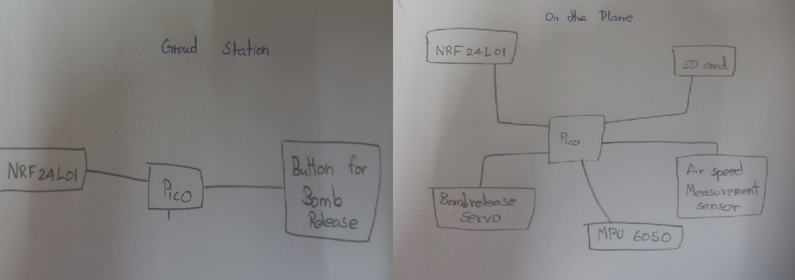
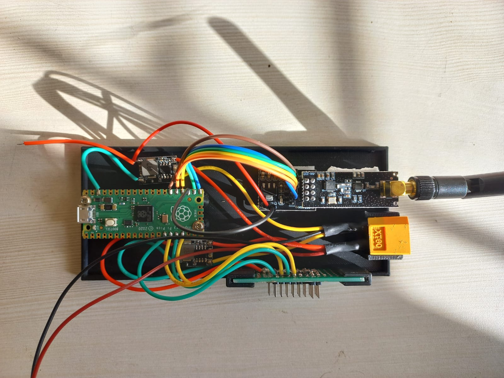
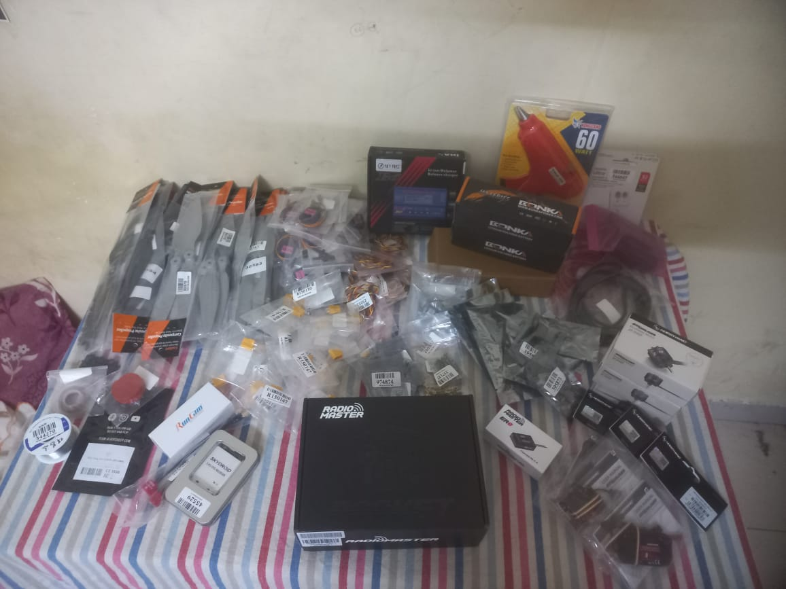
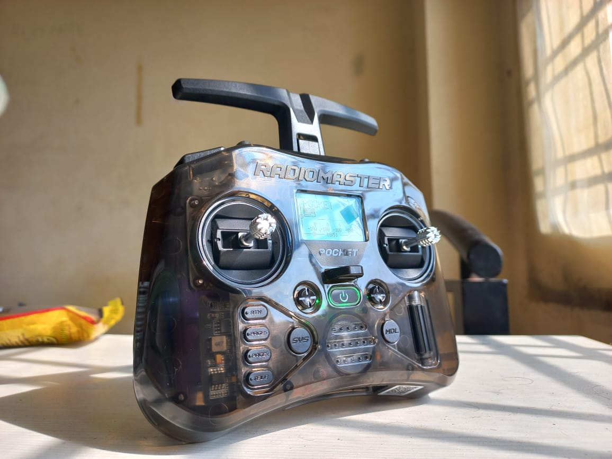
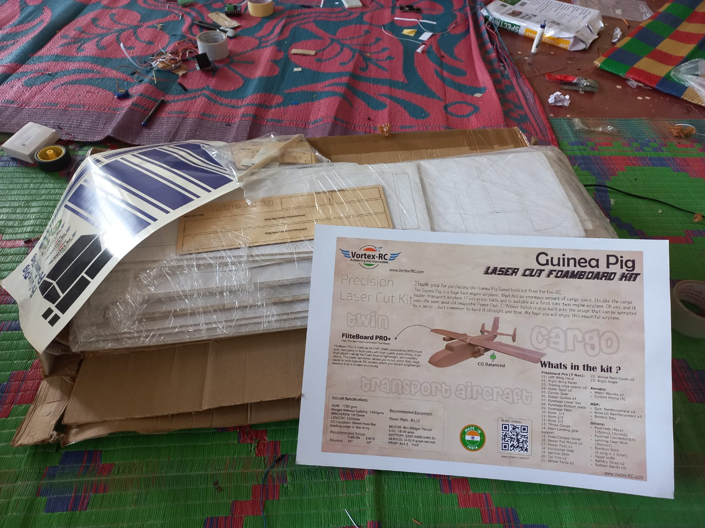
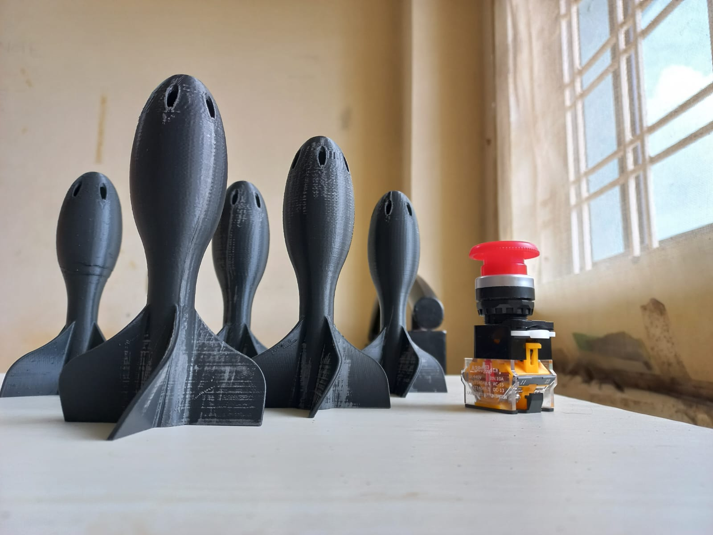
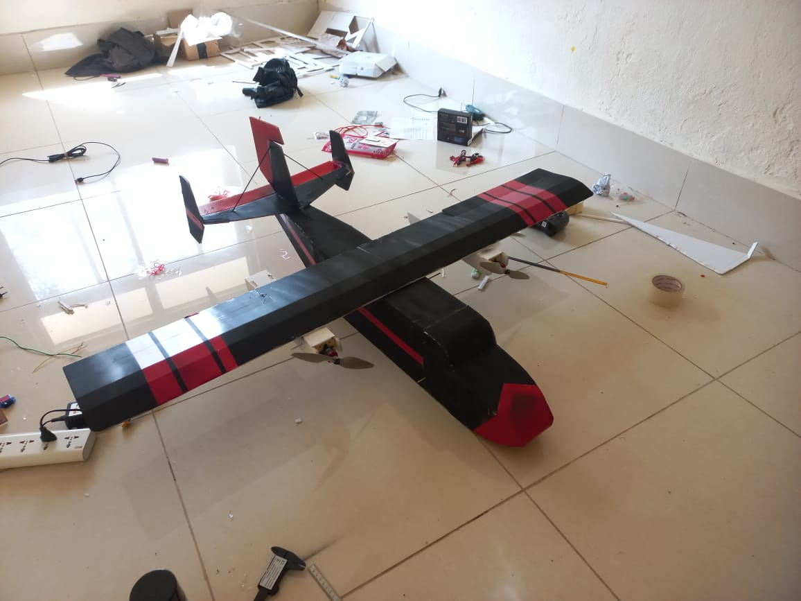
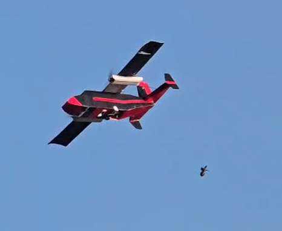
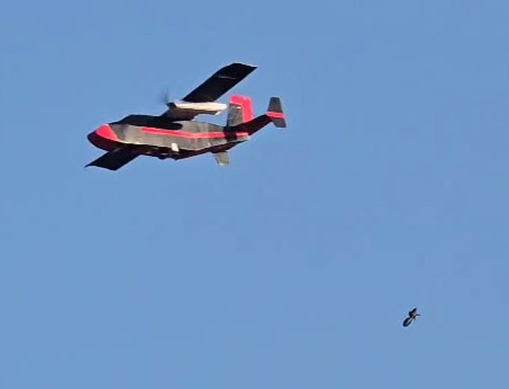
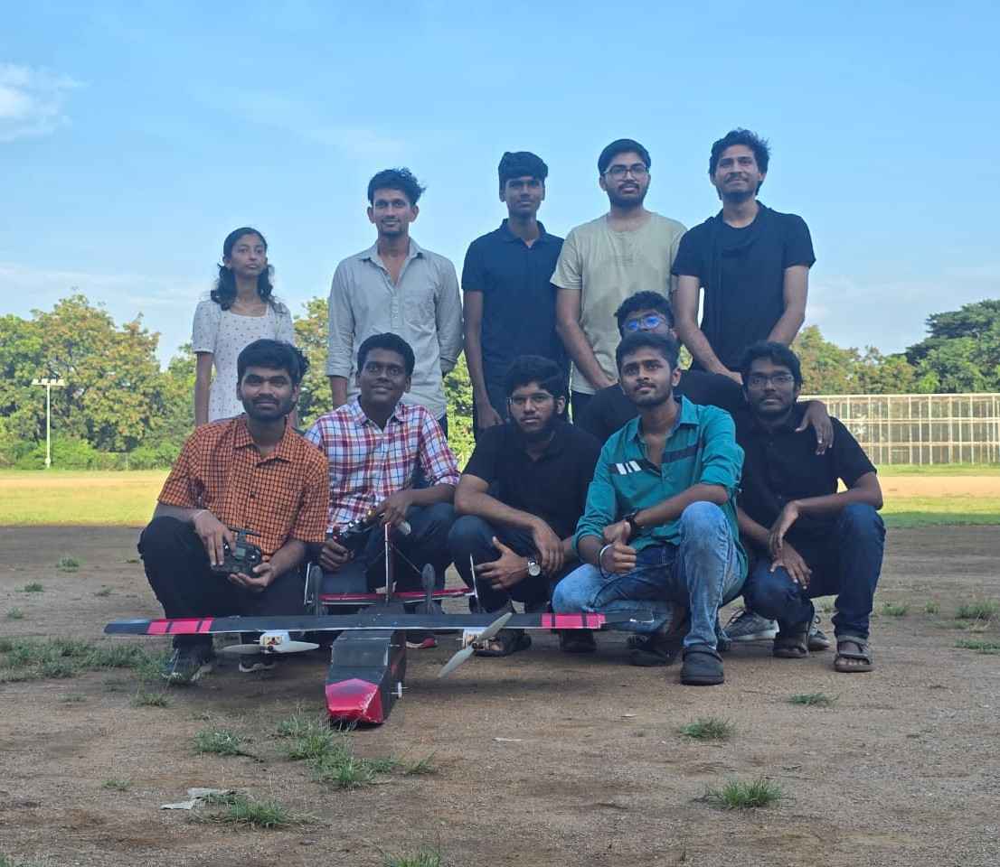

# ✈️ Bombs Away — Our RC Plane + Custom Logging System

*Why buy expensive telemetry when you can build it yourself?*

Welcome to our foam-board RC plane project built for the *Bombs Away* event at our annual tech fest.

---

## Overview

We designed and built a **remote-controlled airplane** from scratch using **foam board**, and embedded a **secondary data logging system** to record in-flight parameters in real time.  Participants would be handed a big red switch in order to drop our custom 3d-printed 'bombs' onto a predefined target.

The goal was simple:  
*Fly steady, analyze live analog camera feed, drop the payload accurately, and collect cool data while doing it.*

### Key Achievements
- Designed a lightweight but strong RC aircraft using foam board. (FliteTest Guinea Pig)
- Implemented long-range wireless communication for data logging.
- Collected and stored sensor data mid-flight using our custom module:
    - Wrote a [custom micropython library](https://github.com/Rayyan973/micropython-library-for-MS4525DO-airspeed-sensor) for the MS4525DO airspeed sensor.
    - Fiddled around with NRF24L01 modules until they *finally* decided to cooperate.
    - Utilized the **_threads** library on a raspberry pi pico for parallelization of send/receive commands.
- Dropped payloads on target (atleast that was the plan).

---

## 🛠️ Hardware Used

| Component | Purpose |
|------------|----------|
| **Primary Transmitter** | Radiomaster Pocket |
| **Motors (x2)** | 980kv bldc motors with 40A ESCs paired with 10in props |
| **NRF24L01 Modules** | Secondary system for data logging |
| **Raspberry Pi Pico (x2)** | Flight logger (TX) + Ground receiver (RX) |
| **Sensors** | mpu6050 IMU, ms4525do airspeed sensor, SD card module |
| **Video system** | Runcam Phoenix 2 pro + TBS unify pro VTX |

---

## Logging System Architecture

We built a **secondary on-board system** separate from the flight controller — a mini “black box” for our RC plane.  

**Overview:**
- One **Raspberry Pi Pico** mounted on the plane acts as a **transmitter**, reading sensor data and sending data packets via an **NRF24L01**.
- Another **Pico** on the ground acts as a **receiver**, displaying/recording the received data, while simultaneously sending 'bomb release' commands on demand.
- Modified SPI protocol using **multi-threading** built on top of NRF24L01 ensures reliable packet delivery and concurrent sending and receiving of signals.

---

## Gallery

#### Planning stage:
Rough layout of the ground side and air side systems:

Wokwi simulation because we didnt have the parts in hand by then :(

Initial testing of the nrf24 communication system:
[initial_wireless_system_testing](gallery/initial_wireless_system_testing.mp4)

Finished air side system:

Pic of all the electronics before assembly!

What a beauty (it even has games builtin like whattttt)

Plane foam parts arrived:

Live analog camera feed:
[video](gallery/live_analog_feed.mp4)

### Build phase:

Finished plane (forgot to take pics of the process):

Testing the primary transmitter:
[tx_test_working_video](gallery/tx_test_working_video.mp4)

Control surfaces (servos are pretty cool)
[video](gallery/control_surfaces_test.mp4)

Power test on the ground:
[watch video](gallery/ground_flighttest.mp4)

Bomb arsenal with arming switch:

Plane after painting:

### Flights:

Maiden flight + crash:
(yep we crashed first try)
[watch maidenflight](gallery/maiden_flight.mp4)

Another flight:
[flight2](gallery/flight2.mp4)

Bomb drop + terrific crash:
[video](gallery/flight3_bomb-drop_crash.mp4)

Swag images of the bomb dropping:

The team :D
